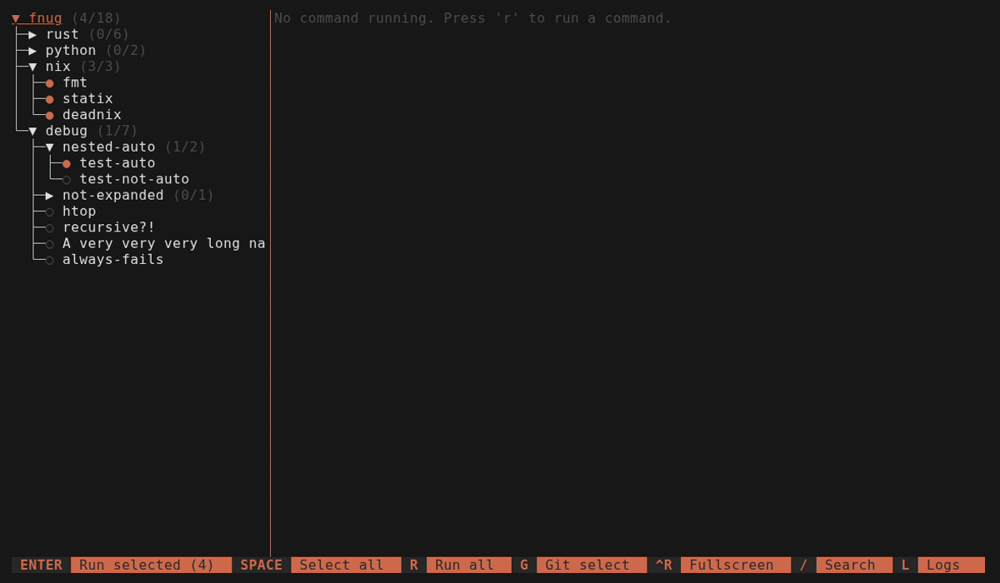

# Fnug

> [!WARNING]
> The main branch is currently undergoing a refactor to Rust. If you're looking for the latest Python version, see the [`python`](https://github.com/nickolaj-jepsen/fnug/tree/python) branch.

[](https://github.com/nickolaj-jepsen/fnug/actions)
[](https://crates.io/crates/fnug)
[](https://pypi.python.org/pypi/fnug)

Fnug is a TUI command runner that automatically selects and executes lint and test commands based on git changes or file watching. Think of it as a terminal multiplexer (like [tmux](https://github.com/tmux/tmux/wiki)), but purpose-built for running your dev commands side by side.



## Features

- **Git integration** — automatically select commands based on uncommitted file changes
- **File watching** — monitor the file system and re-select commands when files change
- **Terminal emulation with scrollback** — full PTY support for interactive commands and long output
- **Headless mode** (`fnug check`) — run selected commands without the TUI, useful for CI
- **Git hook integration** (`fnug init-hooks`) — install a pre-commit hook that runs `fnug check`
- **Command dependencies** — define `depends_on` to control execution order
- **Environment variables** — set per-command or per-group env vars
- **Nested command groups** — organize commands into a hierarchical tree with inherited settings
- **Workspace support** — discover and merge `.fnug.yaml` files from subdirectories in mono-repos

## Installation

### From crates.io

```bash
cargo install fnug
```

### From PyPI

```bash
# With uv
uv tool install fnug

# With pipx
pipx install fnug
```

### From GitHub Releases

Download a prebuilt binary from [GitHub Releases](https://github.com/nickolaj-jepsen/fnug/releases).

### With Nix

```bash
# Run directly
nix run github:nickolaj-jepsen/fnug

# Or install to profile
nix profile install github:nickolaj-jepsen/fnug
```

### From source

```bash
git clone https://github.com/nickolaj-jepsen/fnug.git
cd fnug
cargo install --path .
```

## Usage

Run `fnug` in a directory with a `.fnug.yaml` configuration file (or pass `-c path/to/config.yaml`).

### Subcommands

| Command           | Description                                                     |
| ----------------- | --------------------------------------------------------------- |
| `fnug`            | Launch the TUI                                                  |
| `fnug check`      | Run selected commands headlessly (exit code reflects pass/fail) |
| `fnug init-hooks` | Install a git pre-commit hook that runs `fnug check`            |

### Flags

| Flag              | Description                                                     |
| ----------------- | --------------------------------------------------------------- |
| `-c <path>`       | Path to config file                                             |
| `--no-workspace`  | Disable workspace resolution (don't search for a parent root)   |
| `--log-file`      | Write logs to a file                                            |

## Configuration

Fnug searches for `.fnug.yaml`, `.fnug.yml`, or `.fnug.json` from the current directory upward.

### Minimal example

```yaml
fnug_version: 0.1.0
name: my-project
commands:
  - name: hello
    cmd: echo world
```

### Git auto-selection

Select commands based on uncommitted changes. Re-trigger with `g` in the TUI.

```yaml
fnug_version: 0.1.0
name: my-project
commands:
  - name: lint
    cmd: cargo clippy
    auto:
      git: true
      path:
        - "./src"
      regex:
        - "\\.rs$"
```

### File watching

Monitor the file system and select commands when matching files change. Can be combined with git auto.

```yaml
fnug_version: 0.1.0
name: my-project
commands:
  - name: test
    cmd: cargo test
    auto:
      watch: true
      path:
        - "./src"
      regex:
        - "\\.rs$"
```

### Excluding commands from check mode

Commands with `auto.check: false` are skipped during `fnug check` (and git hooks) but remain auto-selected in the TUI. Use `fnug check --all` to include them.

Useful for commands that are too slow or noisy for pre-commit checks but you still want to run them automatically in the TUI.

```yaml
fnug_version: 0.1.0
name: my-project
commands:
  - name: unit tests
    cmd: cargo test
    auto:
      git: true
  - name: integration tests
    cmd: cargo test --release
    auto:
      git: true
      check: false   # skip in `fnug check`, still auto-selected in TUI
```

### Nested groups with inheritance

Groups inherit `cwd`, `auto`, and `env` settings from their parent.

```yaml
fnug_version: 0.1.0
name: my-project
children:
  - name: backend
    auto:
      git: true
      watch: true
      path:
        - "./src"
      regex:
        - "\\.rs$"
    commands:
      - name: fmt
        cmd: cargo fmt
      - name: test
        cmd: cargo test
      - name: clippy
        cmd: cargo clippy
```

### Workspace

Workspace mode discovers `.fnug.yaml` files in subdirectories and merges them as child groups. This is useful for mono-repos where each package has its own config.

When `workspace: true`, fnug walks the filesystem (skipping `.gitignore`'d and hidden directories) to find sub-configs. Files do not need to be git-tracked to be discovered.

```yaml
# Auto-discover sub-configs (walks up to 5 levels deep)
fnug_version: 0.1.0
name: my-monorepo
workspace: true
commands:
  - name: root-lint
    cmd: echo "root"
```

```yaml
# Custom max scan depth
workspace:
  max_depth: 2
```

```yaml
# Explicit glob patterns
workspace:
  paths:
    - "./packages/*/"
    - "./apps/*/"
```

When run from a subdirectory that contains a `.fnug.yaml`, fnug automatically resolves upward to the nearest workspace root. Use `--no-workspace` to disable this behavior.

### Advanced example

See this project's [`.fnug.yaml`](.fnug.yaml) for a full example.

## Keyboard Shortcuts

| Key       | Context  | Action                            |
| --------- | -------- | --------------------------------- |
| `j` / `↓` | Tree     | Move down                         |
| `k` / `↑` | Tree     | Move up                           |
| `h` / `←` | Tree     | Collapse group / Deselect command |
| `l` / `→` | Tree     | Expand group / Select command     |
| `Space`   | Tree     | Toggle expand/select              |
| `Enter`   | Tree     | Run all selected commands         |
| `r`       | Tree     | Run current command               |
| `s`       | Tree     | Stop current command              |
| `c`       | Tree     | Clear current command             |
| `g`       | Tree     | Git auto-select                   |
| `/`       | Tree     | Search/filter commands            |
| `Esc`     | Search   | Clear search                      |
| `L`       | Tree     | Toggle log panel                  |
| `Tab`     | Tree     | Focus terminal                    |
| `Esc`     | Terminal | Back to tree                      |
| `Ctrl+R`  | Global   | Toggle fullscreen                 |
| `Ctrl+C`  | Global   | Quit                              |
| `q`       | Tree     | Quit                              |

### Mouse

- **Click** a tree item to select it
- **Double-click** a command to run it, or a group to expand/collapse
- **Click** the selection orb (●/○) or arrow (▼/▶) to toggle
- **Drag** the separator between tree and terminal to resize
- **Scroll wheel** in the terminal panel to scroll output
- **Right-click** a command for a context menu with run/stop/clear options
