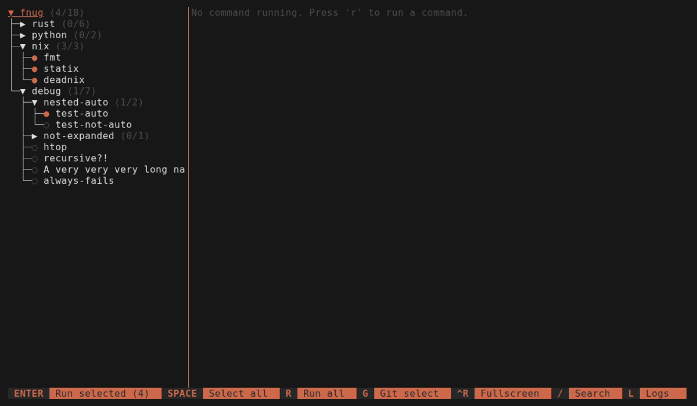

# Fnug

[](https://github.com/nickolaj-jepsen/fnug/actions)
[](https://crates.io/crates/fnug)
[](https://pypi.python.org/pypi/fnug)

Fnug is a TUI command runner that automatically selects and executes lint and test commands based on git changes or file watching. Think of it as a terminal multiplexer (like [tmux](https://github.com/tmux/tmux/wiki)), but purpose-built for running your dev commands side by side.



## Features

- **Git integration** — automatically select commands based on uncommitted file changes
- **File watching** — monitor the file system and re-select commands when files change
- **Terminal emulation with scrollback** — full PTY support for interactive commands and long output
- **Headless mode** (`fnug check`) — run selected commands without the TUI, useful for CI
- **Setup wizard** (`fnug setup`) — install a pre-commit hook that runs `fnug check` and add the MCP server to your editor
- **Command dependencies** — define `depends_on` to control execution order
- **Environment variables** — set per-command or per-group env vars
- **Nested command groups** — organize commands into a hierarchical tree with inherited settings
- **Workspace support** — discover and merge `.fnug.yaml` files from subdirectories in mono-repos

## Installation

Linux and macOS only; commands run via `sh -c`.

### From crates.io

Only prereleases are published so far. `cargo install fnug` skips prereleases, so name the version explicitly:

```bash
cargo install --locked fnug@0.1.0-alpha.13
```

### From PyPI

The latest stable release on PyPI (0.0.x) is the old Python implementation, so allow prereleases:

```bash
# With uv
uv tool install --prerelease=allow fnug

# With pipx
pipx install --pip-args=--pre fnug
```

### From GitHub Releases

Download a prebuilt binary from [GitHub Releases](https://github.com/nickolaj-jepsen/fnug/releases).

### With Nix

```bash
# Run directly
nix run github:nickolaj-jepsen/fnug

# Or install to profile
nix profile install github:nickolaj-jepsen/fnug
```

### From source

```bash
git clone https://github.com/nickolaj-jepsen/fnug.git
cd fnug
cargo install --path .
```

## Usage

Run `fnug` in a directory with a `.fnug.yaml` configuration file (or pass `-c path/to/config.yaml`).

### Subcommands

| Command       | Description                                                     |
| ------------- | --------------------------------------------------------------- |
| `fnug`        | Launch the TUI                                                  |
| `fnug check`  | Run selected commands headlessly (exit code reflects pass/fail) |
| `fnug setup`  | Interactive wizard: git pre-commit hook and editor MCP config   |
| `fnug mcp`    | Run an MCP server over stdio                                    |
| `fnug schema` | Print the config file's JSON Schema                             |

### Flags

| Flag              | Description                                                     |
| ----------------- | --------------------------------------------------------------- |
| `-c <path>`       | Path to config file, always loaded as the root                  |
| `--no-workspace`  | Disable workspace resolution (don't search for a parent root)   |
| `--root <dir>`    | Resolve the config's paths and workspace against `<dir>` instead of the config's directory, and don't look for a parent workspace root; without `-c`, search for the config from `<dir>` |
| `--log-file`      | Write logs to a file                                            |
| `--log-level`     | Log level: off, error, warn, info, debug, trace (default: info) |
| `--fail-fast`     | Stop on first failure (`check` only)                            |
| `--no-tui`        | Never prompt to open TUI on failure (`check` only)              |
| `--mute-success`  | Suppress output for passing commands (`check` only)             |
| `--all`           | Include commands with `auto.check: false` (`check` only)        |

## Configuration

Fnug searches for `.fnug.yaml`, `.fnug.yml`, or `.fnug.json` from the current directory upward.

Unknown keys are errors, so a typo like `depends-on` or `gti` fails loudly with its line number and a suggestion instead of being ignored. YAML anchors and aliases work (`auto: *defaults`), but merge keys (`<<: *defaults`) are not supported.

### Minimal example

```yaml
fnug_version: 0.1.0
name: my-project
commands:
  - name: hello
    cmd: echo world
```

### Git auto-selection

Select commands based on uncommitted changes. Re-trigger with `g` in the TUI.

```yaml
fnug_version: 0.1.0
name: my-project
commands:
  - name: lint
    cmd: cargo clippy
    auto:
      git: true
      path:
        - "./src"
      regex:
        - "\\.rs$"
```

### File watching

Monitor the file system and select commands when matching files change. Can be combined with git auto.

```yaml
fnug_version: 0.1.0
name: my-project
commands:
  - name: test
    cmd: cargo test
    auto:
      watch: true
      path:
        - "./src"
      regex:
        - "\\.rs$"
```

### Always auto-selection

Mark commands that should always be selected, regardless of git changes or file watching.

```yaml
fnug_version: 0.1.0
name: my-project
commands:
  - name: typecheck
    cmd: cargo check
    auto:
      always: true
```

### Excluding commands from check mode

Commands with `auto.check: false` are skipped during `fnug check`, git hooks and the MCP `run_lints`/`run_all` tools, but remain auto-selected in the TUI. Use `fnug check --all` to include them, or MCP `run_lint` to run one by name.

Useful for commands that are too slow or noisy for pre-commit checks but you still want to run them automatically in the TUI.

```yaml
fnug_version: 0.1.0
name: my-project
commands:
  - name: unit tests
    cmd: cargo test
    auto:
      git: true
  - name: integration tests
    cmd: cargo test --release
    auto:
      git: true
      check: false   # skip in `fnug check`, still auto-selected in TUI
```

### Nested groups with inheritance

Groups inherit `cwd`, `auto`, and `env` settings from their parent. Each `auto` field is inherited on its own, so a group's `check: false` applies to every command below it unless a command sets `check` itself.

```yaml
fnug_version: 0.1.0
name: my-project
children:
  - name: backend
    auto:
      git: true
      watch: true
      path:
        - "./src"
      regex:
        - "\\.rs$"
    commands:
      - name: fmt
        cmd: cargo fmt
      - name: test
        cmd: cargo test
      - name: clippy
        cmd: cargo clippy
```

`auto.path` and `auto.regex` are inherited separately and both must match, so a command that narrows `path` keeps the group's `regex`. Set `regex: []` to drop an inherited regex (any file under `path` matches), or `path: []` to reset `path` to the command's own directory:

```yaml
fnug_version: 0.1.0
name: my-project
children:
  - name: rust
    auto:
      git: true
      path: ["./src"]
      regex: ["\\.rs$"]
    commands:
      - name: test
        cmd: cargo test
      - name: lockfile
        cmd: cargo check --locked
        auto:
          path: ["./Cargo.toml"]
          regex: []
```

### Environment variables

`env` adds environment variables to every command in a group, or to one command, on top of the ones it inherits. In a value, `$VAR` and `${VAR}` expand to the inherited value of `VAR`, or else to fnug's own environment; an unset variable expands to nothing, with a warning. Write `$$` for a literal `$`. Variables in the same `env` map don't see each other.

```yaml
fnug_version: 0.1.0
name: my-project
env:
  PATH: "./node_modules/.bin:$PATH"
commands:
  - name: lint
    cmd: eslint .
    env:
      ESLINT_CACHE: "${HOME}/.cache/eslint"
```

### Ids and dependencies

Every command and group has an id, which `depends_on` and the MCP tools use. It defaults to the name, with `/` replaced by `-`. When several commands or groups would get the same default id, each of them gets its group path instead, such as `backend/test` and `frontend/test`. Set `id` to choose one yourself; explicit ids must be unique and can't contain `/`.

fnug resolves a `depends_on` entry within the command's config file, using the first of these that matches:

1. an id, or the name of one of the command's siblings;
2. a group path like `backend/test`;
3. a name that is unique in the file;
4. the full id of a command in another workspace package or the root, like `api/build`.

If an entry is the id of one command and also the name of a sibling, fnug reports an error rather than guessing. Use the sibling's group path, or give the other command a different `id`.

```yaml
fnug_version: 0.1.0
name: my-project
children:
  - name: backend
    commands:
      - name: build
        cmd: cargo build
      - name: test
        cmd: cargo test
        depends_on: [build]   # the sibling: backend/build
  - name: frontend
    commands:
      - name: build
        cmd: pnpm build
      - name: test
        cmd: pnpm test
        depends_on: [build]   # frontend/build
```

### Workspace

Workspace mode discovers `.fnug.yaml` files in subdirectories and merges them as child groups. This is useful for mono-repos where each package has its own config.

When `workspace: true`, fnug walks the filesystem (skipping `.gitignore`'d and hidden directories) to find sub-configs. Files do not need to be git-tracked to be discovered.

```yaml
# Auto-discover sub-configs (walks up to 5 levels deep)
fnug_version: 0.1.0
name: my-monorepo
workspace: true
commands:
  - name: root-lint
    cmd: echo "root"
```

```yaml
# Custom max scan depth
workspace:
  max_depth: 2
```

```yaml
# Explicit glob patterns
workspace:
  paths:
    - "./packages/*/"
    - "./apps/*/"
```

Each package behaves the same as when fnug runs inside it on its own: its `cwd` and `auto.path` are relative to the package directory, and it inherits no `cwd`, `auto` or `env` from the root config. Package ids are prefixed with the package's id, which defaults to its `name`, so a `build` command in a package named `api` has the id `api/build`. Inside a package, `depends_on: [build]` means the package's own `build`; reference another package's command by its full id (`api/build`) and a root command by its id.

When fnug finds a config by searching upward (no `-c`), it loads a parent workspace root instead if that root's own discovery includes the config. A config the root doesn't discover, for example in a gitignored or hidden directory, below `max_depth`, or not matched by `paths`, is loaded on its own. Parent configs that fail to parse, or whose discovery fails, are skipped with a warning. `-c` always loads the given file as the root. Use `--no-workspace` to never look for a parent workspace root.

### Trusted configs

A config runs commands as you, so fnug only loads a config it found by itself (in the current directory or a parent, as a parent workspace root, or as a workspace package) if the file is owned by you or by root, much like git's `safe.directory`. A config passed with `-c` is always loaded. If the nearest config belongs to another user, fnug stops with an error; an untrusted parent workspace root or package is skipped with a warning.

To trust configs owned by someone else, for example in a CI container where the checkout belongs to a different user, list their directories in `FNUG_SAFE_DIRECTORIES`, separated by `:`. Set it to `*` to trust every config.

Running fnug as root, for example with `sudo`, trusts only configs owned by root, so your own repository's config is refused. Pass it with `-c` instead.

### Advanced example

See this project's [`.fnug.yaml`](.fnug.yaml) for a full example.

### Editor support

fnug publishes a JSON Schema for config files, so editors can complete keys and flag mistakes. With the YAML language server (VS Code's YAML extension, Neovim's `yamlls`), add this as the first line of `.fnug.yaml`:

```yaml
# yaml-language-server: $schema=https://raw.githubusercontent.com/nickolaj-jepsen/fnug/main/schema/fnug.schema.json
```

In `.fnug.json`, use a `"$schema"` key with the same URL. `fnug schema` prints the schema for the installed version.

### Configuration reference

#### Root fields

| Field          | Type              | Description                                                       |
| -------------- | ----------------- | ----------------------------------------------------------------- |
| `fnug_version` | string            | Optional. fnug version the config targets (see below)             |
| `name`         | string            | Display name for the root group                                   |
| `workspace`    | bool / object     | Enable workspace mode (see [Workspace](#workspace))               |
| `commands`     | list              | Top-level commands                                                |
| `children`     | list              | Nested command groups                                             |
| `cwd`          | string            | Working directory (inherited by children)                         |
| `env`          | map               | Environment variables (inherited by children, `$VAR` expanded)    |
| `auto`         | object            | Default auto rules (inherited by children)                        |
| `$schema`      | string            | JSON Schema URL for editors (mainly for `.fnug.json`); ignored    |

`fnug_version` compares only the `major.minor.patch` numbers, so `0.1.0` matches `0.1.0-alpha.13`. fnug warns when the config needs a newer fnug, when it was written for an older release series (a different minor version before 1.0, a different major version after), or when the version can't be parsed.

#### Command fields

| Field        | Type              | Description                                                         |
| ------------ | ----------------- | ------------------------------------------------------------------- |
| `name`       | string            | Display name (required)                                             |
| `cmd`        | string            | Shell command to run (required)                                     |
| `id`         | string            | Identifier — defaults to the name ([Ids](#ids-and-dependencies))    |
| `cwd`        | string            | Working directory override                                          |
| `env`        | map               | Extra environment variables (`$VAR` expanded)                       |
| `auto`       | object            | Auto-selection rules (see below)                                    |
| `depends_on` | list of strings   | Commands that must finish first, by id or unique name               |
| `scrollback` | integer           | PTY scrollback buffer size (number of lines)                        |

#### Group fields

| Field      | Type              | Description                                                           |
| ---------- | ----------------- | --------------------------------------------------------------------- |
| `name`     | string            | Display name (required)                                               |
| `id`       | string            | Identifier — defaults to the name ([Ids](#ids-and-dependencies))      |
| `cwd`      | string            | Working directory (inherited by children)                             |
| `env`      | map               | Environment variables (inherited by children, `$VAR` expanded)        |
| `auto`     | object            | Default auto rules (inherited by children)                            |
| `commands` | list              | Commands in this group                                                |
| `children` | list              | Nested child groups                                                   |

#### Auto fields

| Field    | Type              | Description                                                             |
| -------- | ----------------- | ----------------------------------------------------------------------- |
| `git`    | bool              | Select when git-changed files match `path`/`regex`                      |
| `watch`  | bool              | Select when watched files match `path`/`regex`                          |
| `always` | bool              | Always selected regardless of changes                                   |
| `path`   | list of strings   | Path prefixes to match against (e.g. `"./src"`); they may not exist yet |
| `regex`  | list of strings   | Regex patterns to match against file paths (e.g. `"\\.rs$"`)           |
| `check`  | bool              | Include in `fnug check` — set `false` to skip (default `true`)         |

## Keyboard Shortcuts

| Key       | Context  | Action                            |
| --------- | -------- | --------------------------------- |
| `j` / `↓` | Tree     | Move down                         |
| `k` / `↑` | Tree     | Move up                           |
| `h` / `←` | Tree     | Collapse group / Deselect command |
| `l` / `→` | Tree     | Expand group / Select command     |
| `Space`   | Tree     | Toggle expand/select              |
| `Enter`   | Tree     | Run all selected commands         |
| `r`       | Tree     | Run current command               |
| `s`       | Tree     | Stop current command              |
| `c`       | Tree     | Clear current command             |
| `g`       | Tree     | Git auto-select                   |
| `/`       | Tree     | Search/filter commands            |
| `Esc`     | Search   | Clear search                      |
| `L`       | Tree     | Toggle log panel                  |
| `Tab`     | Tree     | Focus terminal                    |
| `Esc`     | Terminal | Back to tree                      |
| `Ctrl+R`  | Global   | Toggle fullscreen                 |
| `Ctrl+C`  | Global   | Quit                              |
| `q`       | Tree     | Quit                              |

### Mouse

- **Click** a tree item to select it
- **Double-click** a command to run it, or a group to expand/collapse
- **Click** the selection orb (●/○) or arrow (▼/▶) to toggle
- **Drag** the separator between tree and terminal to resize
- **Scroll wheel** in the terminal panel to scroll output
- **Right-click** a command for a context menu with run/stop/clear options

## Migrating from 0.1.0-alpha.13

- Unknown config keys are errors. Fix any key the error names (it suggests the closest valid key), and replace YAML merge keys (`<<: *anchor`) with a plain alias (`auto: *anchor`).
- `auto.regex: []` and `auto.path: []` now clear the value inherited from the parent group instead of being ignored. If you wrote `regex: []` expecting the group's regex to apply, remove the line.
- Ids default to the command or group name instead of a random UUID, and names that repeat get group-path ids such as `backend/test`. `depends_on` entries can now be names. Explicit ids can't contain `/`.
- Workspace packages no longer inherit `cwd`, `auto` or `env` from the root config, and a package's `cwd` is relative to its own directory, so it behaves the same merged or standalone. Package ids are prefixed with the package id (`api/build`); update `depends_on` entries that point into another package.
- `-c`/`--config` loads the given file as the root and no longer switches to a parent workspace root. Without `-c`, a parent workspace root is used only when its discovery includes the nearest config, and parent configs that fail to parse are skipped instead of failing the run.
- fnug refuses a config it finds by itself that is owned by another user (other than root). Pass the file with `-c`, or set `FNUG_SAFE_DIRECTORIES` to the directories to trust (`*` trusts all, e.g. in CI containers where the checkout has a different owner).
- `$` in `env` values now expands variables (`$VAR`, `${VAR}`). Write `$$` for a literal `$`.
- Library API: `pty::terminal::Terminal::new` takes `TerminalOptions` instead of a scrollback size, and `Terminal::wait` returns an `ExitInfo` instead of an exit code. `pty::format_success_message` and `pty::format_failure_message` are replaced by `pty::format_exit_message`.
- Stop, restart and clear send `SIGINT` to the command's whole process group, then `SIGKILL` 2 s later if it is still running; previously they sent one `SIGHUP` to the shell. Quitting sends `SIGHUP` to the whole process group too. Library API: `Terminal::kill` is replaced by `Terminal::stop` and `Terminal::force_kill`, and `tui::app::ProcessInstance::kill_and_abort` by `stop_and_abort`.
