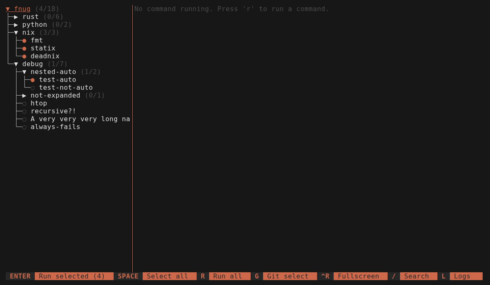

# Fnug

[](https://github.com/nickolaj-jepsen/fnug/actions)
[](https://crates.io/crates/fnug)
[](https://pypi.python.org/pypi/fnug)

Fnug is a TUI command runner that automatically selects and executes lint and test commands based on git changes or file watching. Think of it as a terminal multiplexer (like [tmux](https://github.com/tmux/tmux/wiki)), but purpose-built for running your dev commands side by side.



## Features

- **Git integration** — automatically select commands based on uncommitted, staged or branch changes
- **File watching** — monitor the file system and re-select commands when files change
- **Terminal emulation with scrollback** — full PTY support for interactive commands and long output
- **Headless mode** (`fnug check`) — run selected commands without the TUI, in a pre-commit hook or in CI
- **Config scaffolding** (`fnug init`) — write a starter `.fnug.yaml` for the Rust, Python, Node, Go or Nix tooling it finds
- **Setup wizard** (`fnug setup`) — install a pre-commit hook that runs `fnug check` and add the MCP server to your editor
- **Command dependencies** — define `depends_on` to control execution order
- **Environment variables** — set per-command or per-group env vars
- **Nested command groups** — organize commands into a hierarchical tree with inherited settings
- **Workspace support** — discover and merge `.fnug.yaml` files from subdirectories in mono-repos

## Installation

Linux and macOS only; commands run via `sh -c`.

### From crates.io

Only prereleases are published so far. `cargo install fnug` skips prereleases, so name the version explicitly:

```bash
cargo install --locked fnug@0.1.0-alpha.13
```

### From PyPI

The latest stable release on PyPI (0.0.x) is the old Python implementation, so allow prereleases:

```bash
# With uv
uv tool install --prerelease=allow fnug

# With pipx
pipx install --pip-args=--pre fnug
```

### From GitHub Releases

Download a prebuilt binary from [GitHub Releases](https://github.com/nickolaj-jepsen/fnug/releases).

### With Nix

```bash
# Run directly
nix run github:nickolaj-jepsen/fnug

# Or install to profile
nix profile install github:nickolaj-jepsen/fnug
```

### From source

```bash
git clone https://github.com/nickolaj-jepsen/fnug.git
cd fnug
cargo install --path .
```

## Usage

Run `fnug` in a directory with a `.fnug.yaml` configuration file (or pass `-c path/to/config.yaml`). `fnug init` creates one.

### Subcommands

| Command       | Description                                                     |
| ------------- | --------------------------------------------------------------- |
| `fnug`        | Launch the TUI                                                  |
| `fnug check`  | Run selected commands headlessly; see [What `fnug check` runs](#what-fnug-check-runs) |
| `fnug init [dir]` | Create a `.fnug.yaml` for the project's tooling             |
| `fnug setup`  | Interactive wizard: git pre-commit hook and editor MCP config   |
| `fnug mcp`    | Run an MCP server over stdio                                    |
| `fnug schema` | Print the config file's JSON Schema                             |

### Flags

| Flag              | Description                                                     |
| ----------------- | --------------------------------------------------------------- |
| `-c <path>`       | Path to config file, always loaded as the root                  |
| `--no-workspace`  | Disable workspace resolution (don't search for a parent root)   |
| `--root <dir>`    | Resolve the config's paths and workspace against `<dir>` instead of the config's directory, and don't look for a parent workspace root; without `-c`, search for the config from `<dir>` |
| `--log-file`      | Also write logs to a file                                       |
| `--log-level`     | Log level: off, error, warn, info, debug, trace (default: info, and warn on stderr) |
| `--fail-fast`     | Stop on first failure (`check` only)                            |
| `--no-tui`        | Never prompt to open TUI on failure (`check` only)              |
| `--mute-success`  | Capture each command's output and print it only if it fails (`check` only) |
| `--all`           | Run every command except `auto.check: false` ones (add `--include-manual` for those) instead of the ones changes select (`check` only) |
| `--include-manual` | Also run commands with `auto.check: false` (`check` only)      |
| `--base <ref>`    | Select by the changes since the merge base of `HEAD` and `<ref>`, such as `origin/main`: commits since then plus uncommitted changes (`check` only) |
| `--staged`        | Select by the changes staged for the next commit, or in a pre-commit hook the ones being committed; unstaged and untracked changes don't count (`check` only) |
| `--stash`         | Needs `--staged`: set unstaged changes to tracked files aside while commands run, so they check exactly what is staged; each command's output is captured and printed when it ends (`check` only) |
| `--allow-modifications` | Don't fail commands that change tracked files (`check` only) |
| `--timeout <dur>` | Kill commands that run longer than `<dur>` (seconds, or e.g. `90s`, `5m`) unless their config sets `timeout` (`check` only) |
| `-j`, `--jobs <n>` | Run up to `<n>` commands at once, each after its dependencies; `0` means one per CPU (default `1`, `check` only) |
| `--force`         | Replace the directory's config (`init` only)                    |
| `-y`, `--yes`     | Include everything detected without asking (`init` only)        |
| `-V`, `--version` | Print fnug's version                                            |

`-c`, `--no-workspace`, `--root`, `--log-file` and `--log-level` work with every subcommand. By default, warnings and errors, such as a config that needs a newer fnug, go to stderr in every mode, except while the TUI is open; then they show in its log panel (`L`). `--log-level` or the `FNUG_LOG` environment variable sets the stderr level too: `info` or `debug` shows more, and `error` or `off` hides warnings. fnug never logs to stdout, which `fnug mcp` uses for the protocol.

`fnug check` prints a line for each command, such as `PASS`, `FAIL (exit 3)`, `TIMEOUT after 5m`, `SKIP (build failed)`, `CANCELLED` or `NOT RUN`, then a summary that counts every selected command once: passed, failed, timed out, skipped because a dependency failed, cancelled, and not run. When `--fail-fast` stops a run, commands still running are stopped and counted as cancelled, and commands not yet started as not run. Without `--mute-success` or `--stash`, commands share fnug's terminal and their output streams through. With `--mute-success`, fnug prints `[i/N] name` when a command starts and its result when it ends, followed by the command's output, captured with stdout and stderr merged in order, if it didn't pass. `--stash` alone does the same, but prints the output of commands that pass too. `--jobs` above 1 captures output the same way and prints each command's result line and output, unless it passed and `--mute-success` is set, as soon as the command finishes. Commands still start in config order once their dependencies pass, and an `exclusive` one waits until nothing else runs and holds back the rest until it ends.

Captured commands, from `--mute-success`, `--stash`, `--jobs` above 1, the pre-commit hook or an MCP run, have no terminal. Their stdin is `/dev/null`, and each runs in a session of its own, so opening `/dev/tty`, as password and host-key prompts do, fails at once instead of waiting for input that never comes. When a captured command's shell exits, fnug stops whatever the command left running in its process group, since such a process would keep the output pipe open; start a process that should keep running in a session of its own, for example with `setsid`. Captured output keeps the first 256 KiB and the last 1 MiB of what a command writes, with `… N bytes omitted …` in between.

When none of fnug's stdin, stdout and stderr is a terminal, as in CI, streamed commands run in a session of their own too, and fnug stops what they leave running in the same way. A pipe on stdout alone isn't enough: `fnug check | tee check.log` from a shell keeps the terminal on stdin and stderr. From a terminal, a streamed command stays in fnug's process group so it can use the terminal, and fnug signals only the command's own process: a process it started, such as a test binary under `cargo test`, can outlive a timeout or a signal and keep writing to the terminal. Use `--mute-success` or `--jobs` for timeouts that stop the whole process tree. `--stash` always captures output for the same reason, so that nothing a command started writes to files once your unstaged changes are back.

On SIGINT, SIGTERM or SIGHUP, `fnug check` stops the running commands, prints the summary so far, marked `Interrupted.`, and exits with 128 plus the signal number. On Ctrl+C (SIGINT), a command that shares fnug's terminal has already got the terminal's SIGINT, so fnug gives it 3 s to finish before sending SIGTERM, while a command in a session of its own gets SIGINT from fnug. On SIGTERM or SIGHUP, commands get the same signal. A timeout, `--fail-fast` and an MCP client's cancellation send SIGTERM. Whichever signal a command gets, it gets SIGKILL if it is still running 3 s later. Signals reach the whole process group of a command in a session of its own, but only the process of a command that shares fnug's terminal.

### What `fnug check` runs

By default, `fnug check` runs the `always` commands and the commands whose `auto` rules match an uncommitted change (staged, unstaged or untracked), each after its `depends_on`. Other ways to choose:

| Invocation                      | Runs                                                           |
| ------------------------------- | -------------------------------------------------------------- |
| `fnug check --staged`           | Commands the staged changes select. In a pre-commit hook, those are the changes being committed, also with `git commit -a` and `git commit <path>` |
| `fnug check --base origin/main` | Commands the changes since the merge base of `HEAD` and `origin/main` select: the branch's commits plus uncommitted changes |
| `fnug check --all`              | Every command except `auto.check: false` ones (all of them with `--include-manual`) |
| `fnug check lint "unit tests"`  | The named commands, by id or name                              |

Commands with `auto.check: false` are left out unless you add `--include-manual` or name them. When nothing is selected, fnug says so and exits with 0: `No commands selected (12 configured; use --all, --base <ref>, or name commands)`. With `--staged`, as in the pre-commit hook, it leaves out the hint and prints `No commands selected (12 configured)`, so a commit that only touches docs passes with one line of output.

| Exit code | Meaning                                                              |
| --------- | -------------------------------------------------------------------- |
| 0         | Every command passed, or none was selected                           |
| 1         | A command failed, timed out or changed tracked files, or was skipped or not run |
| 2         | fnug couldn't do its job: a usage error, a config that doesn't load, an unknown or ambiguous name, a `--base` that doesn't resolve in the current directory's repository, `--staged` or `--base` outside a git repository, or unstaged changes it couldn't set aside or put back |
| 128+n     | Stopped by signal n                                                  |

The TUI exits with the same codes: 128+n when a signal stops it, 2 when it fails, such as when it can no longer read from or draw to its terminal, and 0 when you quit. When `fnug check` opens the TUI after a failure, quitting it keeps the check's 1.

A fresh CI checkout has no uncommitted changes, so plain `fnug check` selects nothing there. In a pull request, compare with the target branch; elsewhere, run everything. `--base` needs the merge base in the clone, so fetch the whole history:

```yaml
- uses: actions/checkout@v5
  with:
    fetch-depth: 0
- if: github.event_name == 'pull_request'
  run: fnug check --base "origin/${GITHUB_BASE_REF:-main}"
- if: github.event_name != 'pull_request'
  run: fnug check --all
```

`--base` compares in the git repository that contains the current directory, not the config file's, so `fnug -c /elsewhere/fnug.yaml check --base origin/main` works when run inside the repository. The base has to resolve there even when no command has `auto.git`, so a typo in it fails the run instead of running only the `always` commands. In a workspace whose packages are other repositories, such as submodules, a package repository where the base doesn't resolve, or that has no commits yet, gets a warning and none of its commands are selected; the rest still run.

If the checkout belongs to another user than the one running fnug, as in some containers, see [Trusted configs](#trusted-configs).

`fnug check` fails a command that exits with 0 but changes tracked files, and prints `FAIL (modified: src/a.rs — review and re-stage)`. Otherwise a formatter that rewrites files would pass while the commit keeps the unformatted version. Run the checking form in check mode (`cargo fmt --check`, `ruff format --check`), give fixers `auto.check: false` so only the TUI runs them, or pass `--allow-modifications`. New untracked files and ignored files don't count. With `--jobs` above 1, a change counts against every command that was running when it happened; the run fails either way. The TUI and the MCP server let commands change files.

### Checking what is committed

`--staged` decides which commands run, but they still see the work tree, with edits you haven't staged. Add `--stash` to check exactly what is staged: fnug saves the unstaged changes to tracked files as a patch in the git directory, checks the tracked files out from the index, and applies the patch again once the commands have exited. The pre-commit hook that `fnug setup` installs runs `fnug check --staged --stash --fail-fast --mute-success --jobs 0`.

- Untracked files stay where they are, and files added with `git add -N` stay intent-to-add.
- It works on the repository that contains the current directory, as `--staged` does, not the one that contains the config file. It covers that whole repository, even when the hook runs fnug from a subdirectory, and works the same in a linked worktree, a submodule or a repository with a separate git directory. In a workspace, other repositories, such as submodules, aren't touched.
- When a command changes a file that also has unstaged changes, as a formatter can, fnug always discards the command's changes to that file when it puts yours back, even when the two don't overlap, and says so: `Commands changed files that also have unstaged changes, so their changes to those files were discarded to put yours back.` Its changes to files without unstaged changes stay. Unless you pass `--allow-modifications`, the command has already failed for changing files.
- fnug deletes the patch once the files it changes hold exactly your changes again. Otherwise it keeps the patch and prints its path.
- A signal doesn't stop fnug before it has put the changes back. If fnug is killed with SIGKILL, the next `fnug check --staged --stash` in that worktree puts them back first. When the files they change have changed since, it keeps the patch, says how to apply it by hand and exits with 2. Until then, other `fnug check` runs warn that changes are still set aside. Only one such run works on a worktree at a time; another one exits with 2. Linked worktrees of one repository don't wait for each other.

### Init

`fnug init` writes a `.fnug.yaml` in the current directory, or in the directory you pass, with a group of commands for each kind of tooling it finds there:

| Found                                   | Commands                                                                 |
| --------------------------------------- | ------------------------------------------------------------------------ |
| `Cargo.toml`                            | `cargo fmt --check`, `cargo clippy --all-targets -- -D warnings`, `cargo test` |
| `pyproject.toml`, `ruff.toml`           | `ruff check .`, `ruff format --check .`, and `mypy .` and `pytest` if `pyproject.toml` configures or depends on them (or `mypy.ini`, `pytest.ini` or `conftest.py` exists); prefixed with `uv run`, `poetry run` or `pdm run` when that tool's lockfile exists |
| `package.json`                          | Its `format:check`, `lint`, `typecheck` and `test` scripts, run with pnpm, yarn, bun or npm to match the lockfile; `test` gets `CI=true` so test runners don't start in watch mode |
| `go.mod`                                | A `gofmt -l` check that fails if gofmt fails or lists any file, `go vet ./...`, `go test ./...` |
| `flake.nix`                             | `alejandra --check .`, `statix check .` and `deadnix --fail .`, each only if it is on `PATH` |

Each group's commands are selected by uncommitted changes to the files they check (`auto.git`) and by edits to them while fnug runs (`auto.watch`). `fnug init` asks which groups to include; `--yes`, or a stdin that isn't a terminal, includes them all. If it finds nothing, the config has an example command to replace. The file starts with a comment that points the YAML language server at the schema for your fnug version (see [Editor support](#editor-support)) and sets `fnug_version`.

It never replaces an existing config unless you pass `--force`, which rewrites the config fnug loads from that directory in its own format. Run it in a workspace package's directory to give that package a config of its own.

### Setup

`fnug setup` installs a git pre-commit hook that runs `fnug check --staged --stash --fail-fast --mute-success --jobs 0`, which checks what is being committed (see [Checking what is committed](#checking-what-is-committed)), and adds the MCP server to your editors' project config: `.mcp.json` for Claude Code, `.vscode/mcp.json` and `.cursor/mcp.json`. It lists every change before making any, and makes them only once you confirm. Deselect something to remove it. When neither the directory nor a parent has a config, setup first offers to create one with the groups `fnug init` would propose, and writes it before the hook and the editor entries that run it.

The hook goes where git reads hooks: in `core.hooksPath` if that is set, otherwise in the main repository's `.git/hooks`, which linked worktrees share. If husky manages the hooks, or `core.hooksPath` points outside the repository, setup prints the lines to add yourself instead. A `pre-commit` that is a symlink counts as the file it links to: setup edits that file, shows it in the list of changes, and prints the lines instead if it is outside the repository.

fnug's lines sit between `# >>> fnug >>>` and `# <<< fnug <<<`, right after the shebang of any existing hook, and the rest of that hook runs after fnug passes. If fnug needs something your hook sets up first, such as `PATH`, move the block below it; updates leave it where it is. A hook that isn't a shell script, such as a Python one, can be chained instead: it moves to `pre-commit.local` and runs after fnug, and removing fnug's hook puts it back.

The hook runs `fnug` from `PATH`, or else the binary that ran `fnug setup`, with the `-c`, `--root` and `--no-workspace` that `fnug setup` was given. A different or older fnug on `PATH` still comes first, so setup tells you when the one on its `PATH` isn't the binary running setup: one from before `--staged` and `--stash` fails every commit. It runs from the config's directory. With `--root`, it runs from that directory instead, and goes in that directory's repository even when the config is in another one. Run setup again after moving the config, and it offers to update the hook. If the hook runs a different config that still exists, as when you run setup from a nested config or with other flags, setup leaves it alone, even when you deselect the hook, and says which config it runs; it repoints the hook only if you say yes when asked. If fnug isn't installed, the commit fails with a hint; a hook in the work tree, such as one in a committed `core.hooksPath` or a committed script that `.git/hooks/pre-commit` links to, only warns, so teammates without fnug can still commit.

In a workspace, setup also offers a hook for each package whose config is in another repository, such as a git submodule. That hook runs the package's checks with `--no-workspace`.

Setup edits the editor configs in place, keeping comments and formatting, and adds or removes only the `fnug` entry. The entry runs `fnug mcp` with the `-c`, `--root` and `--no-workspace` that `fnug setup` was given, with paths relative to the project directory the editor starts it in, since the editor config is usually committed. fnug has to be on the editor's `PATH`. Run setup again with other flags, and it offers to update the entry.

### MCP server

`fnug mcp` lets coding agents run your checks through the Model Context Protocol, over stdio. It has four tools:

| Tool         | Description                                                                 |
| ------------ | --------------------------------------------------------------------------- |
| `list_lints` | List the commands, optionally filtered, and whether the current changes select them |
| `run_lints`  | Run the commands the current git changes select, as `fnug check` does       |
| `run_lint`   | Run one command by id or name, after its dependencies                       |
| `run_all`    | Run every command except those with `auto.check: false`                     |

The server loads the config again on every tool call, so edits to it apply without a restart. It also starts when the config is missing or broken; each tool call then fails with the reason until the config is fixed.

Like `fnug check`, `run_lints` and `run_all` skip commands with `auto.check: false` unless `include_manual` is set; `run_lint` runs any command. `run_lints` looks at uncommitted changes, or with `base` (such as `origin/main`) at everything that changed since the merge base with that revision, commits included. When it selects nothing, the result's `message` says why: no changed files, changes that no command's `auto` rules match, or only `auto.check: false` commands selected. Each command in a result has a `reason`: `requested`, `all`, `always`, `git` or `dependency of …`, and a git-selected one lists up to five `matched_files`. `list_lints` shows the same for what the changes select now, takes `base` too, and marks commands with `auto.check: false` with `runs_in_check: false`.

A run returns a compact JSON summary, then a text block for each command that failed or timed out. The summary's `message` sums the run up in a sentence or two, and `commands` lists every planned command, failures first, with its `status` (`passed`, `failed`, `timeout`, `skipped`, `cancelled` or `not_run`), exit code, duration and output size. A text block holds the command's output with stdout and stderr merged in order and terminal escapes and carriage-return overwrites removed, cut to its first 4 KiB and last 16 KiB; `truncated_bytes` in the summary says how much was left out. A result keeps at most 60 KiB of output in all. Set `verbose` to also get the output of commands that passed.

Runs take turns: a run tool called while another run is in progress waits for it to finish, and its summary's `queued_ms` says for how long. As with `fnug check --timeout` and `--jobs`, `timeout_secs` stops a command that runs longer than that many seconds unless its config sets `timeout`, and `run_lints` and `run_all` take `jobs` to run up to that many commands at once. Unlike `fnug check`, runs default to a 10-minute limit (`timeout_secs: 0` for none) and to one command per CPU (`jobs: 1` for one at a time), since an agent can't interrupt a run and gets the output only when it ends.

Cancelling a tool call stops its commands with SIGTERM, or stops it waiting for its turn. When the client closes the server's stdin, the server does the same for every running call, waits up to 10 s for the commands to exit and then exits. On SIGINT, SIGTERM or SIGHUP, running commands get the same signal and the server exits with 128 plus its number. A command still running 3 s after its signal gets SIGKILL.

## Configuration

Fnug searches for `.fnug.yaml`, `.fnug.yml`, or `.fnug.json` from the current directory upward.

Unknown keys are errors, so a typo like `depends-on` or `gti` fails loudly with its line number and a suggestion instead of being ignored. YAML anchors and aliases work (`auto: *defaults`), but merge keys (`<<: *defaults`) are not supported.

### Minimal example

```yaml
fnug_version: 0.1.0
name: my-project
commands:
  - name: hello
    cmd: echo world
```

### Git auto-selection

Select commands based on uncommitted changes. Re-trigger with `g` in the TUI.

```yaml
fnug_version: 0.1.0
name: my-project
commands:
  - name: lint
    cmd: cargo clippy
    auto:
      git: true
      path:
        - "./src"
      regex:
        - "\\.rs$"
```

### File watching

Monitor the file system and select commands when matching files change. Can be combined with git auto.

```yaml
fnug_version: 0.1.0
name: my-project
commands:
  - name: test
    cmd: cargo test
    auto:
      watch: true
      path:
        - "./src"
      regex:
        - "\\.rs$"
```

Add `run_on_change: true` to also run the command when a change selects it, as bacon or cargo-watch do. Like the other `auto` keys, it is inherited by child groups and commands. A change while the command is queued or running gets it one more run once that run ends, and changes in the second after an automatic run ends are ignored, so the files a formatter or `clippy --fix` writes don't start it again right away. A change during the run can still start one extra run. Press `w` in the TUI to turn this off, and on again, for the session.

### Always auto-selection

Mark commands that should always be selected, regardless of git changes or file watching.

```yaml
fnug_version: 0.1.0
name: my-project
commands:
  - name: typecheck
    cmd: cargo check
    auto:
      always: true
```

### Excluding commands from check mode

Commands with `auto.check: false` are skipped during `fnug check`, including `fnug check --all`, git hooks and the MCP `run_lints`/`run_all` tools, but remain auto-selected in the TUI. Use `fnug check --include-manual` to include them, name them (`fnug check "integration tests"`), or use MCP `run_lint` to run one by name. A command that another command depends on runs with it either way.

Useful for commands that are too slow or noisy for pre-commit checks but you still want to run them automatically in the TUI.

```yaml
fnug_version: 0.1.0
name: my-project
commands:
  - name: unit tests
    cmd: cargo test
    auto:
      git: true
  - name: integration tests
    cmd: cargo test --release
    auto:
      git: true
      check: false   # skip in `fnug check`, still auto-selected in TUI
```

### Nested groups with inheritance

Groups inherit `cwd`, `auto`, `env`, `timeout` and `exclusive` from their parent. Each `auto` field is inherited on its own, so a group's `check: false` applies to every command below it unless a command sets `check` itself.

```yaml
fnug_version: 0.1.0
name: my-project
children:
  - name: backend
    auto:
      git: true
      watch: true
      path:
        - "./src"
      regex:
        - "\\.rs$"
    commands:
      - name: fmt
        cmd: cargo fmt --check
      - name: test
        cmd: cargo test
      - name: clippy
        cmd: cargo clippy
```

`auto.path` and `auto.regex` are inherited separately and both must match, so a command that narrows `path` keeps the group's `regex`. Set `regex: []` to drop an inherited regex (any file under `path` matches), or `path: []` to reset `path` to the command's own directory:

```yaml
fnug_version: 0.1.0
name: my-project
children:
  - name: rust
    auto:
      git: true
      path: ["./src"]
      regex: ["\\.rs$"]
    commands:
      - name: test
        cmd: cargo test
      - name: lockfile
        cmd: cargo check --locked
        auto:
          path: ["./Cargo.toml"]
          regex: []
```

### Environment variables

`env` adds environment variables to every command in a group, or to one command, on top of the ones it inherits. In a value, `$VAR` and `${VAR}` expand to the inherited value of `VAR`, or else to fnug's own environment; an unset variable expands to nothing, with a warning. Write `$$` for a literal `$`. Variables in the same `env` map don't see each other.

```yaml
fnug_version: 0.1.0
name: my-project
env:
  PATH: "./node_modules/.bin:$PATH"
commands:
  - name: lint
    cmd: eslint .
    env:
      ESLINT_CACHE: "${HOME}/.cache/eslint"
```

### Matched files

A command that `fnug check` or MCP `run_lints` selects through `auto.git` gets the changed files that selected it in `FNUG_FILES`, one per line, relative to its `cwd` when they are inside it (with `./` in front of a path that starts with `-`) and absolute otherwise. Files that no longer exist are left out. `{files}` in `cmd` becomes the same list, each path in single quotes for the shell:

```yaml
fnug_version: 0.1.0
name: my-project
commands:
  - name: ruff
    cmd: ruff check {files}
    auto:
      git: true
      path: ["./python"]
      regex: ["\\.py$"]
```

A command without such a list gets no `FNUG_FILES`, and `{files}` becomes its `auto.path` entries (`.` for its own `cwd`, or when it has none), so it checks everything it covers. That happens when you name it or pass `--all`, when it runs only as another command's dependency, when it has no `auto.git`, when all its matched files were deleted, and, with a warning, when the list is longer than 100 KiB. The TUI doesn't pass file lists yet.

### Ids and dependencies

Every command and group has an id, which `depends_on` and the MCP tools use. It defaults to the name, with `/` replaced by `-`. When several commands or groups would get the same default id, each of them gets its group path instead, such as `backend/test` and `frontend/test`. Set `id` to choose one yourself; explicit ids must be unique and can't contain `/`. If two still end up with the same id (siblings with the same name, or a command and a group with the same name in one group), fnug reports an error naming both; set `id` on one of them.

fnug resolves a `depends_on` entry within the command's config file, using the first of these that matches:

1. an id, or the name of one of the command's siblings;
2. a group path like `backend/test`;
3. a name that is unique in the file;
4. the full id of a command in another workspace package or the root, like `api/build`.

If an entry is the id of one command and also the name of a sibling, fnug reports an error rather than guessing. Use the sibling's group path, or give the other command a different `id`.

```yaml
fnug_version: 0.1.0
name: my-project
children:
  - name: backend
    commands:
      - name: build
        cmd: cargo build
      - name: test
        cmd: cargo test
        depends_on: [build]   # the sibling: backend/build
  - name: frontend
    commands:
      - name: build
        cmd: pnpm build
      - name: test
        cmd: pnpm test
        depends_on: [build]   # frontend/build
```

### Workspace

Workspace mode discovers `.fnug.yaml` files in subdirectories and merges them as child groups. This is useful for mono-repos where each package has its own config.

When `workspace: true`, fnug walks the filesystem (skipping `.gitignore`'d and hidden directories) to find sub-configs. Files do not need to be git-tracked to be discovered. Outside a git repository nothing counts as ignored, so only hidden directories are skipped.

```yaml
# Auto-discover sub-configs (walks up to 5 levels deep)
fnug_version: 0.1.0
name: my-monorepo
workspace: true
commands:
  - name: root-lint
    cmd: echo "root"
```

```yaml
# Custom max scan depth
workspace:
  max_depth: 2
```

```yaml
# Explicit glob patterns
workspace:
  paths:
    - "./packages/*/"
    - "./apps/*/"
```

Each package behaves the same as when fnug runs inside it on its own: its `cwd` and `auto.path` are relative to the package directory, and it inherits none of the root config's `cwd`, `auto`, `env`, `timeout` or `exclusive`. Package ids are prefixed with the package's id, which defaults to its `name`, so a `build` command in a package named `api` has the id `api/build`. Package ids must be unique across the workspace and must not match a root group's id. Inside a package, `depends_on: [build]` means the package's own `build`; reference another package's command by its full id (`api/build`) and a root command by its id.

When fnug finds a config by searching upward (no `-c`), it loads a parent workspace root instead if that root's own discovery includes the config. A config the root doesn't discover, for example in a gitignored or hidden directory, below `max_depth`, or not matched by `paths`, is loaded on its own. Parent configs that fail to parse, or whose discovery fails, are skipped with a warning. `-c` always loads the given file as the root. Use `--no-workspace` to never look for a parent workspace root.

### Trusted configs

A config runs commands as you, so fnug only loads a config it found by itself (in the current directory or a parent, as a parent workspace root, or as a workspace package) if the file is owned by you or by root, much like git's `safe.directory`. A config passed with `-c` is always loaded. If the nearest config belongs to another user, fnug stops with an error; an untrusted parent workspace root or package is skipped with a warning.

To trust configs owned by someone else, for example in a CI container where the checkout belongs to a different user, list their directories in `FNUG_SAFE_DIRECTORIES`, separated by `:`. Set it to `*` to trust every config.

Running fnug as root, for example with `sudo`, trusts only configs owned by root, so your own repository's config is refused. Pass it with `-c` instead.

### Advanced example

See this project's [`.fnug.yaml`](.fnug.yaml) for a full example.

### Editor support

fnug publishes a JSON Schema for config files, so editors can complete keys and flag mistakes. With the YAML language server (VS Code's YAML extension, Neovim's `yamlls`), add this as the first line of `.fnug.yaml`:

```yaml
# yaml-language-server: $schema=https://raw.githubusercontent.com/nickolaj-jepsen/fnug/main/schema/fnug.schema.json
```

In `.fnug.json`, use a `"$schema"` key with the same URL. `fnug schema` prints the schema for the installed version.

### Configuration reference

#### Root fields

| Field          | Type              | Description                                                       |
| -------------- | ----------------- | ----------------------------------------------------------------- |
| `fnug_version` | string            | Optional. fnug version the config targets (see below)             |
| `name`         | string            | Display name for the root group                                   |
| `workspace`    | bool / object     | Enable workspace mode (see [Workspace](#workspace))               |
| `commands`     | list              | Top-level commands                                                |
| `children`     | list              | Nested command groups                                             |
| `cwd`          | string            | Working directory (inherited by children)                         |
| `env`          | map               | Environment variables (inherited by children, `$VAR` expanded)    |
| `auto`         | object            | Default auto rules (inherited by children)                        |
| `timeout`      | integer / string  | Default command `timeout` (inherited by children)                 |
| `exclusive`    | bool              | Default command `exclusive` (inherited by children)               |
| `$schema`      | string            | JSON Schema URL for editors (mainly for `.fnug.json`); ignored    |

`fnug_version` compares only the `major.minor.patch` numbers, so `0.1.0` matches `0.1.0-alpha.13`. fnug warns when the config needs a newer fnug, when it was written for an older release series (a different minor version before 1.0, a different major version after), or when the version can't be parsed.

#### Command fields

| Field        | Type              | Description                                                         |
| ------------ | ----------------- | ------------------------------------------------------------------- |
| `name`       | string            | Display name (required)                                             |
| `cmd`        | string            | Shell command to run (required)                                     |
| `id`         | string            | Identifier — defaults to the name ([Ids](#ids-and-dependencies))    |
| `cwd`        | string            | Working directory override                                          |
| `env`        | map               | Extra environment variables (`$VAR` expanded)                       |
| `auto`       | object            | Auto-selection rules (see below)                                    |
| `depends_on` | list of strings   | Commands that must finish first, by id or unique name               |
| `scrollback` | integer           | PTY scrollback buffer size (number of lines)                        |
| `timeout`    | integer / string  | Time limit in `fnug check` and MCP runs (see below)                 |
| `exclusive`  | bool              | Never run alongside another command in `fnug check --jobs` runs     |

`timeout` is whole seconds or a duration with units, such as `90s`, `5m` or `1h 30m`. A command that runs longer in `fnug check` or an MCP run gets `SIGTERM`, then `SIGKILL` 3 s later, and is reported as `TIMEOUT`. The signals reach every process in the command's process group, unless the command streams to fnug's terminal: then only its own process gets them (see `fnug check` above). `0` means no limit, overriding an inherited value and `fnug check --timeout`. There is no limit by default, and the TUI ignores `timeout`.

`exclusive: true` suits commands that rewrite files, such as formatters, so that nothing reads the files while they change. It matters only when `fnug check --jobs` runs several commands at once; the TUI ignores it.

#### Group fields

| Field      | Type              | Description                                                           |
| ---------- | ----------------- | --------------------------------------------------------------------- |
| `name`     | string            | Display name (required)                                               |
| `id`       | string            | Identifier — defaults to the name ([Ids](#ids-and-dependencies))      |
| `cwd`      | string            | Working directory (inherited by children)                             |
| `env`      | map               | Environment variables (inherited by children, `$VAR` expanded)        |
| `auto`     | object            | Default auto rules (inherited by children)                            |
| `timeout`  | integer / string  | Default command `timeout` (inherited by children)                     |
| `exclusive` | bool             | Default command `exclusive` (inherited by children)                   |
| `commands` | list              | Commands in this group                                                |
| `children` | list              | Nested child groups                                                   |

#### Auto fields

| Field    | Type              | Description                                                             |
| -------- | ----------------- | ----------------------------------------------------------------------- |
| `git`    | bool              | Select when git-changed files match `path`/`regex`                      |
| `watch`  | bool              | Select when watched files match `path`/`regex`                          |
| `always` | bool              | Always selected regardless of changes                                   |
| `path`   | list of strings   | Path prefixes to match against (e.g. `"./src"`); they may not exist yet |
| `regex`  | list of strings   | Patterns for file paths relative to `cwd` (e.g. `"^src/.*\\.rs$"`)      |
| `check`  | bool              | Include in `fnug check` — set `false` to skip (default `true`)         |
| `run_on_change` | bool         | In the TUI, run the command when a watched change selects it (default `false`) |

A changed file selects a command when it is under one of its `path` entries and matches one of its `regex` patterns (any file, if there are none). The patterns see the file's path relative to the command's `cwd`, such as `src/main.rs`, or `../shared/lib.rs` for a file outside it. Anchor with `^` to match from the `cwd` (`^tests/`), or write `(^|/)tests/` to match a directory at any depth.

Neither `git` nor `watch` counts files that git ignores (through `.gitignore`, `.git/info/exclude` or `core.excludesFile`) or anything inside a `.git` directory. The watcher makes one exception: below a `path` that git ignores itself, such as `./target/doc`, every change counts. It goes by the ignore rules alone, so it also skips a file that git tracks although a rule matches it, which `git` still counts. A watch `path` that doesn't exist when fnug starts is not watched. Like `git`, the watcher doesn't follow symlinked directories. On Linux, a directory that a `.gitignore` edit stops ignoring is only watched once fnug restarts.

## Keyboard Shortcuts

| Key            | Context    | Action                   |
| -------------- | ---------- | ------------------------ |
| `j` / `↓`      | Tree       | Move down                |
| `k` / `↑`      | Tree       | Move up                  |
| `h` / `←`      | Tree       | Collapse / deselect      |
| `l` / `→`      | Tree       | Expand / select          |
| `Space`        | Tree       | Toggle selection         |
| `E`            | Tree       | Expand all groups        |
| `W`            | Tree       | Collapse all groups      |
| `/`            | Tree       | Search and filter        |
| `Enter`        | Tree       | Run selected commands    |
| `r`            | Tree       | Run command or group     |
| `s`            | Tree       | Stop command             |
| `x`            | Tree       | Clear command            |
| `g`            | Tree       | Select by git changes    |
| `F5`           | Tree       | Reload the config        |
| `w`            | Tree       | Toggle auto-run          |
| `c`            | Tree       | Copy output              |
| `Shift+↑/↓`    | Tree       | Scroll output            |
| `{` / `}`      | Tree       | Output top / bottom      |
| `Tab`          | Tree       | Type into the command    |
| `Ctrl+R`       | Tree       | Toggle fullscreen        |
| `L`            | Tree       | Toggle log panel         |
| `?`            | Tree       | Toggle this help         |
| `q` / `Ctrl+C` | Tree       | Quit                     |
| `Enter`        | Search     | Keep the filter          |
| `Esc`          | Search     | Clear the search         |
| `Ctrl+]`       | Terminal   | Back to the tree         |
| `Esc`          | Terminal   | Back, unless full-screen |
| `Esc`          | Fullscreen | Exit fullscreen          |

`?` shows this list in the TUI. `Shift+Home` and `Shift+End` also jump to the top and bottom of the output. While a command has the keyboard, every key but `Ctrl+]` goes to it, and so does `Esc` if it runs a full-screen program.

### Mouse

- **Click** a tree item to select it
- **Double-click** a command to run it, or a group to expand/collapse
- **Click** the selection orb (●/○) or arrow (▼/▶) to toggle
- **Drag** the separator between tree and terminal to resize
- **Scroll wheel** in the terminal panel to scroll output
- **Click** the terminal panel of a running full-screen or mouse-aware program to type into it
- **Right-click** a command for a context menu with run/stop/clear options

### Copying output

`c` copies the command's whole output, scrollback included, without the lines fnug adds before and after it. fnug uses `pbcopy` on macOS and `wl-copy`, `xclip` or `xsel` on Linux, and falls back to OSC 52, an escape sequence that asks the terminal fnug runs in to set the clipboard. Over SSH, OSC 52 comes first, so the text lands on your machine rather than the server. Inside tmux, OSC 52 needs `set -g set-clipboard on`. Output over 1 MiB is cut to its last 1 MiB. Some terminals limit the size of an OSC 52 copy and silently drop a larger one, and fnug can't tell when that happens.

### Reloading the config

The TUI loads the config again when you save one of its files, or when you press `F5`. Commands and groups keep their output, selection and expansion by id. A command that is no longer in the config is stopped, and one that runs while its `cmd`, `cwd` or `env` changed keeps running as it was until you restart it; the toolbar names it. If the new config doesn't load, the old one stays and the toolbar shows why until a reload succeeds. A new workspace package is only picked up by `F5`, since fnug watches the config files it loaded.
